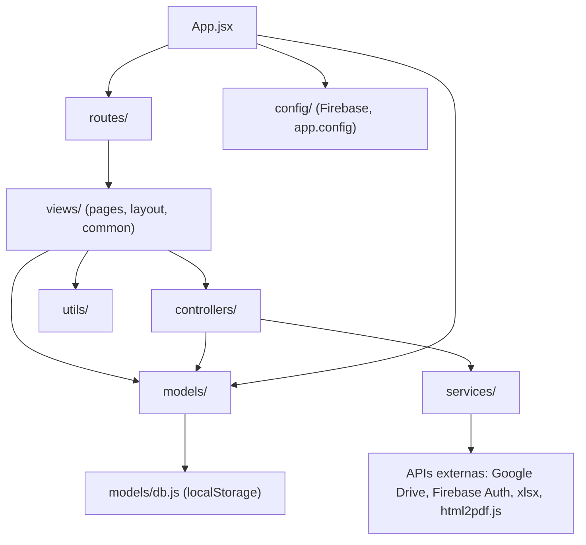

# Arquitectura

Este documento describe la arquitectura del proyecto **Informe PT — Proservis** después de la
migración a una estructura por capas (septiembre 2026). Para el detalle de qué cambió y por qué,
ver [`CHANGELOG.md`](../CHANGELOG.md). Para el modelo de datos, ver [`MODEL.md`](./MODEL.md).

## 1. Qué es esta aplicación

Es una **SPA (Single Page Application)** hecha con **React 19 + Vite**, sin backend propio:

- No hay servidor de aplicación ni API REST/GraphQL propia.
- Los datos (ejecutivos, clientes, informes, espacios/áreas, configuración de módulos) se guardan
  en el **`localStorage`** del navegador, simulando una base de datos (ver `src/models/db.js`).
- **Firebase Authentication** se usa como capa opcional de login (con un *fallback* a
  autenticación local/demo si Firebase no está configurado o falla).
- **Google Drive** (vía OAuth en el navegador) permite explorar carpetas y traer los Excel de un
  cliente sin descargarlos manualmente.
- El "informe" final es un **HTML autocontenido** (CSS y JS inline) que se puede previsualizar en
  un `<iframe>`, descargar como `.html`, o convertir a `.pdf` en el propio navegador
  (con `html2pdf.js`).

Al no existir un backend, **MVC clásico (con controladores de servidor) no aplica tal cual**. Lo
que se implementó es una **adaptación pragmática de MVC para una SPA**, separando
responsabilidades en capas claras y con una dirección de dependencias explícita, para que el
código sea fácil de ubicar, probar y extender.

## 2. Capas y carpetas

```
src/
├── models/          Modelo: acceso a datos + reglas de negocio por entidad (sin React)
├── controllers/      Controlador: orquesta modelos + servicios para un caso de uso concreto
├── services/         Integraciones externas (Google Drive, Excel, PDF, generación de HTML)
├── views/             Vista: componentes React (páginas, layout, componentes comunes)
│   ├── pages/            Una página por ruta (Dashboard, Clientes, NuevoInforme, ...)
│   │   └── nuevo-informe/   Subcomponentes del wizard "Nuevo informe" (uno por paso)
│   ├── layout/            Shell de la app autenticada (header + sidebar + <Outlet/>)
│   └── common/            Componentes reutilizables (Modal, Toast, DriveExplorer)
├── routes/            Definición de rutas + guard de roles (RequireRole)
├── config/            Configuración de Firebase y variables de la app (Google Client ID, etc.)
├── utils/             Helpers puros sin estado (formato de fechas y periodos)
├── assets/            Logos (base64) y hoja de estilos global
├── App.jsx            Composition root: sesión, listener de Firebase Auth, monta rutas
└── main.jsx           Punto de entrada de Vite/React
```

### Modelo (`models/`)

Cada archivo representa una entidad del dominio y expone funciones puras de lectura/escritura
sobre el "storage" compartido (`models/db.js`). No importan React ni conocen la UI.

| Archivo | Entidad | Responsabilidad |
|---|---|---|
| `db.js` | — | Persistencia de bajo nivel (`localStorage`), semillas de datos demo, migración de datos antiguos |
| `constants.js` | — | Constantes de dominio (roles, catálogo de módulos, listas fijas) |
| `Ejecutivo.js` | Ejecutivo (usuario) | CRUD, autenticación local, sesión actual, helpers de rol |
| `Cliente.js` | Cliente | CRUD, asignación a ejecutivos, carpeta de Drive recordada |
| `Informe.js` | Informe | Guardado/consulta de informes generados |
| `Workspace.js` | Workspace / Area | CRUD de espacios y áreas |
| `ModuloConfig.js` | ModuloConfig | Preferencias de módulos por usuario y por cliente |

### Controlador (`controllers/`)

Un controlador **orquesta** uno o más modelos (y a veces servicios) para resolver un caso de uso
que no pertenece limpiamente a una sola entidad, o que conviene mantener fuera de la vista:

- `authController.js` — intenta login con Firebase y cae a autenticación local si falla.
- `reportingController.js` — calcula el avance mensual del equipo (cruza Ejecutivo + Cliente +
  Informe).
- `informeController.js` — arma el HTML final del informe, el nombre de archivo de exportación y
  guarda el informe terminado (usado por el wizard `NuevoInforme`).

**Regla de dependencia:** Vista → Controlador → Modelos/Servicios. Los modelos nunca importan
controladores ni vistas.

### Servicios (`services/`)

Todo lo que habla con algo *fuera* de esta app: APIs de Google, la librería `xlsx`, la librería
`html2pdf.js`, y el generador del reporte HTML. Son los únicos módulos que tocan `window.gapi`,
`window.google`, o el DOM para exportar archivos.

| Archivo | Qué hace |
|---|---|
| `googleDrive.service.js` | OAuth de Google + listar/descargar archivos de Drive |
| `excel.service.js` | Parseo de uno o varios Excel/CSV y extracción de las 5 secciones del informe |
| `pdf.service.js` | Exportar el HTML del informe a PDF o a archivo `.html` descargable |
| `htmlReport.service.js` | Renderiza el informe final como HTML autocontenido (CSS + JS inline) |

### Vista (`views/`)

Componentes React puros de presentación + estado de UI local. Llaman a modelos/controladores,
pero no contienen lógica de persistencia ni de integración externa directamente (esa vive en
modelos/servicios/controladores).

- `views/pages/*` — una página por ruta. `NuevoInforme.jsx` (el wizard de "Nuevo informe") es
  solo el orquestador: mantiene el estado del wizard y delega el render de cada paso a un
  componente de `views/pages/nuevo-informe/` (uno por paso — `StepCliente`, `StepHeadcount`,
  `StepSST`, etc. — más `steps.js` con la definición de ambas secuencias de pasos). Así se evita
  un único archivo gigante con los ~16 pasos posibles entre los dos modos.
- `views/layout/Layout.jsx` — cabecera + navegación lateral filtrada por rol + `<Outlet/>`.
- `views/common/*` — `Modal`, `Toast`/`useToast` (contexto de notificaciones) y `DriveExplorer`
  (usado dentro del wizard de "Nuevo informe").

### Rutas (`routes/`)

`AppRoutes.jsx` declara el árbol de rutas (con `react-router-dom`, modo `HashRouter` — ver
[`DEPLOYMENT.md`](./DEPLOYMENT.md) sobre por qué). `RequireRole.jsx` es el guard que redirige o
muestra "acceso restringido" según el rol del usuario.

## 3. Diagrama de dependencias



## 4. Flujo de ejemplo: iniciar sesión

1. `views/pages/Login.jsx` recoge email/password y llama a
   `controllers/authController.loginWithEmailPassword(email, password)`.
2. El controlador intenta `signInWithEmailAndPassword` (Firebase). Si funciona, enriquece el
   usuario de Firebase con el perfil local (rol, workspace) vía `models/Ejecutivo.getUserByEmail`.
3. Si Firebase falla (sin conexión, credenciales no creadas allí, etc.), el controlador cae a
   `models/Ejecutivo.authenticateLocal(email, password)` — el modo "demo" sin backend.
4. El controlador devuelve `{ user }` o `{ error }`; la vista solo actualiza su estado y llama a
   `onLogin(...)` (manejado en `App.jsx`, que guarda la sesión con
   `models/Ejecutivo.setCurrentUser`).

## 5. Flujo de ejemplo: generar un informe (modo automático)

1. `views/pages/NuevoInforme.jsx` sube los Excel del usuario o los trae vía
   `views/common/DriveExplorer.jsx` (que usa `services/googleDrive.service.js`).
2. Los archivos se parsean con `services/excel.service.js` (detección difusa de hojas y
   columnas: Headcount, Selección, Rotación, SST, Nómina).
3. El usuario revisa/ajusta los datos en el wizard (estado local de la vista).
4. Al pedir la vista previa, la vista llama a
   `controllers/informeController.buildInformePreviewHtml(...)`, que arma el HTML final con
   `services/htmlReport.service.js`.
5. Exportar como HTML/PDF usa `services/pdf.service.js`; guardar en el historial usa
   `controllers/informeController.saveInforme(...)`, que persiste con `models/Informe.saveInf`.

## 6. Decisiones y por qué

- **`localStorage` como "base de datos"**: es una app de escritorio de un equipo pequeño sin
  backend propio; todo el estado vive en el navegador de cada persona. Es la razón por la que
  `models/db.js` concentra toda la lectura/escritura a `localStorage` en un solo lugar — si en el
  futuro se migra a un backend real (REST, Firestore, etc.), solo ese archivo (y los modelos que
  lo usan) necesitan cambiar; controladores y vistas no deberían enterarse.
- **`HashRouter`** en vez de `BrowserRouter`: permite desplegar la app como archivos estáticos
  (sin configurar *rewrites* del servidor) — ver [`DEPLOYMENT.md`](./DEPLOYMENT.md).
- **Controladores como capa delgada**: no todo pasó a un controlador. Operaciones triviales de
  una sola línea (ej. `getClis()` en una página de solo lectura) se llaman directo desde la vista;
  solo se creó un controlador donde había lógica de orquestación real (login, reporte de equipo,
  ensamblado del informe).

## 7. Deuda técnica conocida

La migración inicial (septiembre 2026) dejó una serie de comportamientos preexistentes
documentados aquí; una segunda pasada de limpieza (también septiembre 2026, ver
[`CHANGELOG.md`](../CHANGELOG.md)) resolvió la mayoría. Lo que queda pendiente, para que el
equipo decida cuándo abordarlo:

1. **Contraseñas en texto plano en `localStorage`.** El fallback de autenticación local
   (`models/Ejecutivo.js#authenticateLocal`) sigue comparando contraseñas en texto plano
   (aceptable para una demo sin datos reales, pero no para producción). Lo que **sí** se corrigió
   en la segunda pasada: ya no existe una contraseña "comodín" que autenticara como *cualquier*
   usuario — ahora solo la contraseña real guardada de cada Ejecutivo funciona. Antes de un
   despliegue con datos reales de clientes: hashear las contraseñas si se sigue usando auth local,
   y/o exigir que todo login pase por Firebase Authentication.
2. **Config de Firebase y el Client ID de Google sin variables de entorno originalmente.** Ya se
   agregó soporte para `.env` (ver `src/config/*.js` y `.env.example`), pero los valores actuales
   del proyecto `reportes-pt-ejecutivos` siguen como *fallback* hardcodeado para no romper el
   despliegue existente. Recomendado: mover esos valores a variables de entorno del proveedor de
   hosting (ver [`DEPLOYMENT.md`](./DEPLOYMENT.md)) y no depender del fallback en producción. (No
   es una filtración de secretos: la config web de Firebase y el OAuth Client ID de Google son
   identificadores públicos por diseño, protegidos por reglas de seguridad, no por estar ocultos.)
3. **El bundle de producción no está code-splitteado** (`vite build` avisa que el chunk principal
   pesa >500KB). Es aceptable para el tamaño actual de la app; si crece, considerar
   `React.lazy()` por ruta.

Resuelto en la segunda pasada (ya no aplica, se deja registro por transparencia): el toast
(`utils/notify.js#toast()`) que no mostraba nada por buscar un `#toast` inexistente — ahora todas
las vistas usan `useToast()` de `views/common/useToast.js`; el wizard `NuevoInforme.jsx` que tenía
~650 líneas — ahora es un orquestador delgado sobre `views/pages/nuevo-informe/*`; y los archivos
puente de la migración (`src/store.js`, `src/components/*`, etc.) — ya no existen, ver §8.

## 8. Sin archivos de compatibilidad

La migración original dejó los archivos de la estructura plana anterior (`src/store.js`,
`src/config.js`, `src/firebase.js`, `src/gdrive.js`, `src/htmlGenerator.js`,
`src/pdfGenerator.js`, `src/multiExcelParser.js`, `src/logos.js`, `src/style.css`,
`src/driveAuth.js`, `src/excelParser.js`, `src/components/*.jsx`) como **archivos puente** que
solo re-exportaban desde la nueva ubicación, porque en ese momento no fue posible borrarlos
directamente. La segunda pasada de limpieza los eliminó del repositorio. Si tu copia local todavía los tiene
(porque se clonó antes de este cambio, o porque el entorno usado para la limpieza no pudo borrar
archivos directamente en tu máquina), corre una vez el script `cleanup-legacy-shims.ps1` en la
raíz del proyecto — ver [`CHANGELOG.md`](../CHANGELOG.md) para el detalle y la lista exacta de
archivos.
