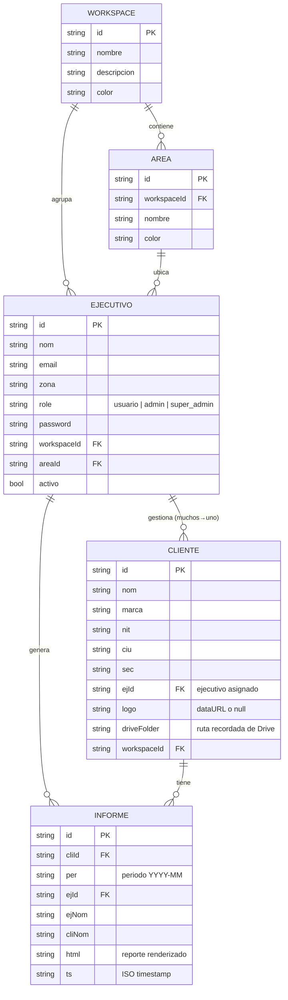

# Modelo de datos

La aplicación no tiene backend: todo el estado vive en el `localStorage` del navegador, en un
único objeto (`DB`, ver `src/models/db.js`) que se serializa bajo la llave `ps_v3`. Este
documento describe las entidades, sus campos y sus relaciones. Para cómo se accede a cada una
desde el código, ver [`ARCHITECTURE.md`](./ARCHITECTURE.md).

## Diagrama de entidades

## Entidades

### Ejecutivo (`models/Ejecutivo.js`)

Representa a cualquier persona que usa el sistema (el nombre viene de "ejecutivo de cuenta", pero
también cubre administradores y super-admins).

| Campo | Tipo | Notas |
|---|---|---|
| `id` | string | `e<timestamp>` al crearse |
| `nom` | string | Nombre completo |
| `email` | string | Normalizado a minúsculas; usado como identificador de login |
| `zona` | string | Ciudad/región, informativo |
| `role` | `'usuario' \| 'admin' \| 'super_admin'` | Ver tabla de roles abajo |
| `password` | string | **Texto plano** — solo para el fallback de autenticación local (ver "Deuda técnica" en ARCHITECTURE.md) |
| `workspaceId` / `areaId` | string (FK) | A qué Workspace/Area pertenece |
| `activo` | bool | Un usuario inactivo no puede autenticarse localmente |

### Cliente (`models/Cliente.js`)

Una empresa para la que un Ejecutivo genera informes mensuales.

| Campo | Tipo | Notas |
|---|---|---|
| `id` | string | `c<timestamp>` |
| `nom`, `marca`, `nit`, `ciu`, `sec` | string | Datos identificatorios |
| `ejId` | string (FK) | Ejecutivo asignado — relación **muchos Clientes → un Ejecutivo**, reasignable en bloque desde "Mi equipo" |
| `logo` | string\|null | Logo del cliente (dataURL), usado en el header del informe |
| `driveFolder` | string | Última ruta de Google Drive usada, para no tener que navegarla de nuevo |
| `workspaceId` | string (FK) | Espacio al que pertenece |

### Informe (`models/Informe.js`)

Un snapshot de un informe ya generado y guardado (append-only: no se edita, solo se crea o
borra).

| Campo | Tipo | Notas |
|---|---|---|
| `id` | string | `i<timestamp>` |
| `cliId`, `ejId` | string (FK) | A quién pertenece |
| `per` | string `YYYY-MM` | Periodo del informe |
| `ejNom`, `cliNom` | string | Copia denormalizada del nombre (para no depender de que el registro original siga existiendo) |
| `html` | string | El HTML completo renderizado (ver `services/htmlReport.service.js`) — es lo que se vuelve a descargar como HTML/PDF desde "Guardados" |
| `headcount`, `seleccion`, `rotacion`, `sst`, `nomina`, `fotos` | objetos/arrays | Los datos crudos de cada sección, por si se necesitan reprocesar |
| `ts` | string ISO | Fecha de creación |

### Workspace / Area (`models/Workspace.js`)

Jerarquía organizacional, gestionada solo por `super_admin`:

**Workspace** ("espacio", ej. *Proservis Temporales*) → **Area** ("área", ej. *Nómina*) →
**Ejecutivo**.

| Workspace | Area |
|---|---|
| `id`, `nombre`, `descripcion`, `color` | `id`, `workspaceId` (FK), `nombre`, `color` |

### ModuloConfig (`models/ModuloConfig.js`)

Preferencias de qué **módulos del informe** (`headcount`, `seleccion`, `rotacion`, `sst`,
`nomina`, `fotos` — ver `MODULOS` en `models/constants.js`) están activos para un usuario, con
posibilidad de sobreescribir por cliente. Se guarda dentro de `DB.moduloConfigs`, con llaves:

- `<userId>` → configuración global del usuario.
- `<userId>_<clienteId>` → override para ese cliente en particular.

## Roles y permisos (RBAC)

| Ruta | usuario | admin | super_admin |
|---|:---:|:---:|:---:|
| `/` (Dashboard) | ✅ | ✅ | ✅ |
| `/clientes`, `/nuevo`, `/config-modulos` | ✅ | ✅ | ✅ |
| `/guardados` | ✅ | ✅ | ✅ |
| `/equipo`, `/aclientes`, `/aejecutivos` | ❌ | ✅ | ✅ |
| `/espacios` | ❌ | ❌ | ✅ |

Aplicado por `routes/RequireRole.jsx` según `docs/ARCHITECTURE.md` §2. El menú lateral
(`views/layout/Layout.jsx`) filtra las opciones visibles con la misma lógica de roles.

## Persistencia (localStorage)

| Llave | Contenido |
|---|---|
| `ps_v3` | El objeto `DB` completo (`ejs`, `clis`, `infs`, `workspaces`, `areas`, `moduloConfigs`) |
| `ps_auth_user` | Usuario de la sesión actual |
| `ps_ej_activo` | Id del ejecutivo activo (para la suplantación de super_admin) |
| `gdrive_token`, `gdrive_token_time` | Token OAuth de Google Drive (expira a los 50 min) |

Ninguno de estos datos sale del navegador de cada persona: no hay sincronización entre
dispositivos ni entre usuarios salvo que compartan el mismo navegador/perfil.
